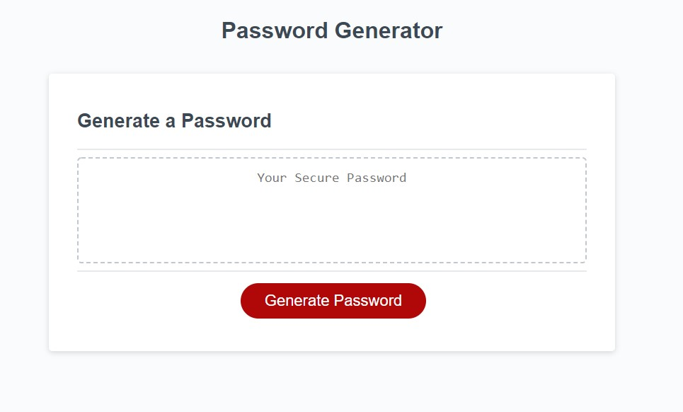
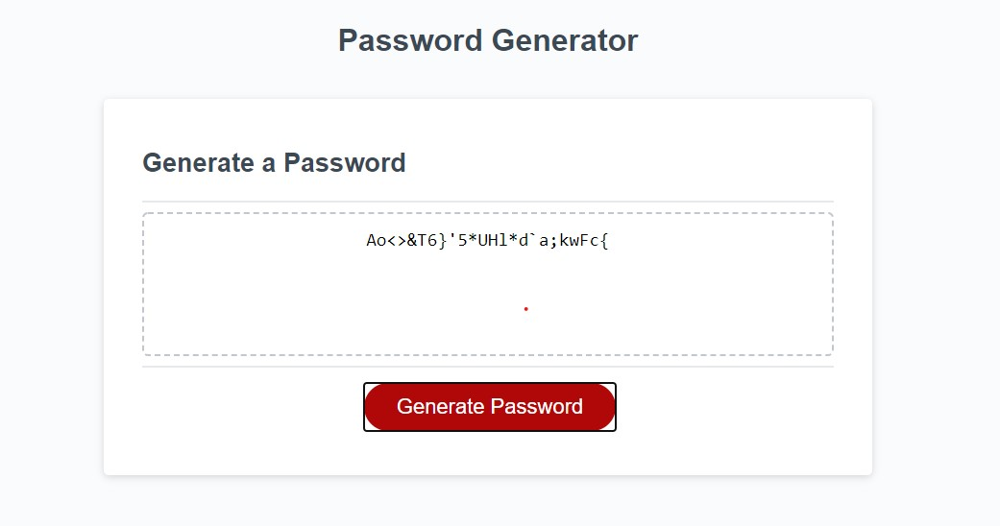

# Password Generator

Website that generates random passwords based on user inputs using prompts.

password generated

## Installation

clone repo and open 'index.html' in preferred browser.

-or-

navigate to https://todayisfineforme.github.io/Password.Generator/

## Usage

click on "Generate Password" and answer prompts.

## Contributing

Pull requests are welcome. For major changes, please open an issue first to discuss what you would like to change.

## License

[MIT](https://choosealicense.com/licenses/mit/)
